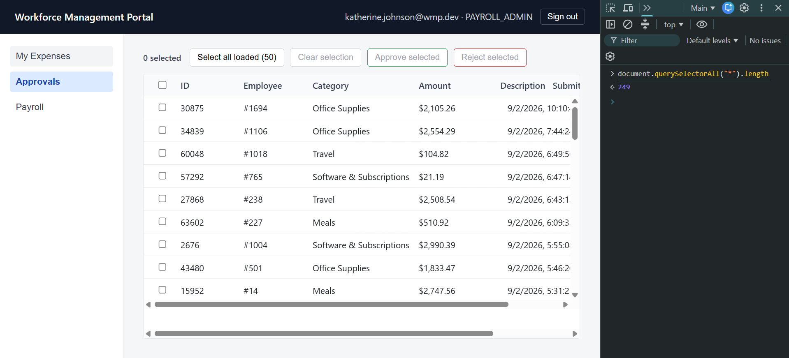
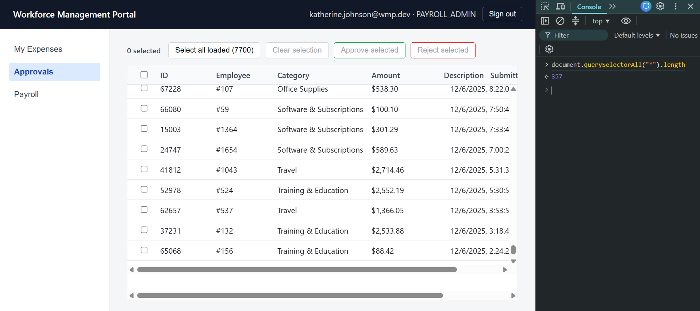
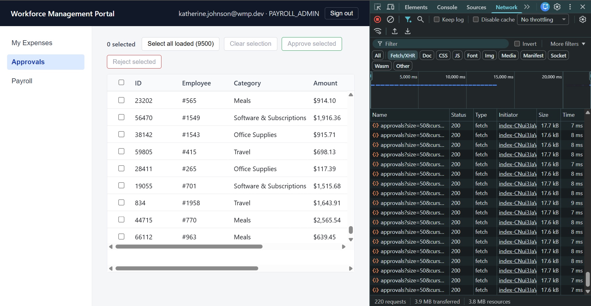
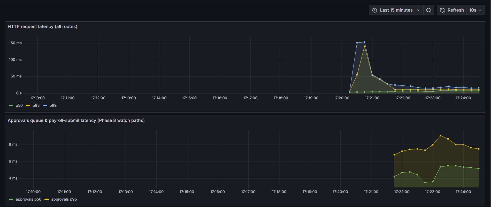

# Workforce Management Portal

A workforce management REST API covering three domains — payroll,
onboarding, and expenses — with a React approvals UI on top. It's a
portfolio project, built to be production-shaped rather than a tutorial
CRUD app: the point of this codebase is the performance and reliability
investigations documented below (pagination at scale, a real connection-pool
leak, frontend virtualization), not the CRUD surface that makes those
investigations possible. It is not enterprise-grade and doesn't claim to be
— it's one backend instance, one Postgres, no HA, no multi-tenant anything.

## Quickstart

```
docker compose up -d --build
docker exec -i wmp-db psql -U wmp -d wmp -f - < load/seed.sql
```

Both steps verified working end-to-end against this exact stack.

The first command builds and starts three containers — `db` (Postgres 16),
`backend` (Spring Boot, `dev,container` profiles), `frontend` (nginx serving
the built React app and reverse-proxying `/api` to the backend) — and waits
on real healthchecks, not just container-start, before returning.
`backend`'s own startup runs `DevDataSeeder`, which creates the departments,
expense categories, roles, and five login accounts everything else depends
on.

The second command is separate on purpose, not an oversight:

- **It's not idempotent.** It refuses to run a second time against an
  already-seeded database (`RAISE EXCEPTION` if its own load-test rows
  already exist) rather than silently duplicating 70,000+ rows.
- **It requires `DevDataSeeder` to have already run.** It reuses the
  departments, expense categories, and the `PAYROLL_ADMIN` account
  `DevDataSeeder` creates rather than duplicating them, and refuses to run
  if they're missing.
- **It takes about 11 seconds** — a raw SQL script (`generate_series` +
  bulk `INSERT...SELECT`), not an ORM-driven seeder, specifically so
  generating ~2,000 employees and 70,000 expense reports doesn't take
  minutes.
- **Right now, this invocation is documented nowhere but the script's own
  header comment.** There is no other README pointing at it, and
  `CLAUDE.md` mentions `/load` only as a directory description. Making
  this discoverable is a main purpose of this file.

### URLs

- App: **http://localhost**
- Swagger / OpenAPI: **http://localhost:8080/swagger-ui.html**

### Dev accounts

Same password for every account: **`wmp-dev-2026!`**

| Email | Role |
|---|---|
| `ada.lovelace@wmp.dev` | EMPLOYEE |
| `alan.turing@wmp.dev` | MANAGER |
| `katherine.johnson@wmp.dev` | PAYROLL_ADMIN |
| `frances.allen@wmp.dev` | HR_ADMIN |
| `system@wmp.dev` | SYSTEM |

## Architecture

```
/backend    Spring Boot API — com.aryanyeole.wmp.<domain>, domain =
            auth | payroll | onboarding | expense | common. Within a
            domain: api (controllers, DTOs), domain (entities, enums),
            repository, service.
/frontend   React 18 + TypeScript + Vite + TanStack Query
/docs       ADRs, incident reports, measurements
/load       seed data + k6-style load scripts
```

Three design commitments actually shaped this codebase, more than any
individual endpoint did:

- **One centralized authorization filter with a declarative permission
  map — no `@PreAuthorize` anywhere.** Every protected route is declared
  once in `PermissionRegistry`; a single `RouteAuthorizationFilter`
  resolves it for every request. No controller carries a security
  annotation, no service carries a role check. See
  [ADR 0001](docs/adr/0001-centralized-authorization.md).
- **DTOs at every boundary.** Controllers never see entities; request and
  response shapes are explicit, hand-mapped classes, not the JPA graph
  serialized directly.
- **RFC 7807 `ProblemDetail` errors, from one place.** A single
  `@RestControllerAdvice` maps application exceptions to `ProblemDetail`
  bodies; no stack traces reach a response.

## The investigations

### Keyset pagination vs. offset, with and without an index

[ADR 0002](docs/adr/0002-keyset-pagination.md)

`GET /api/v1/expenses/approvals` was measured across a real 2×2 — {offset,
keyset} × {no index, index} — against 70,000 `expense_reports` rows
(20,976 `SUBMITTED`), before deciding anything:

**Query execution time (`EXPLAIN ANALYZE`, ms), page 1 / 100 / 500 / 1000:**

| | No index | Index |
|---|---|---|
| **Offset** | 14.1 / 21.5 / 22.7 / 21.3 | 0.2 / 2.7 / **35.1** / **34.0** |
| **Keyset** | 14.9 (shallow) / 10.6 (deep) | 0.9 (shallow) / 0.2 (deep) |

The interesting finding isn't the final flat-and-fast number — it's that
**the index alone, keeping offset pagination, made deep pages worse than no
index at all.** Page 1 drops from 14.1 ms to 0.2 ms and page 100 from
21.5 ms to 2.7 ms — genuine wins. But at page 500/1000, the planner
abandons the ordered index walk for a `Bitmap Heap Scan` + `Sort` over the
full 20,976-row matching set, landing at 35.1 ms / 34.0 ms — *worse* than
the no-index baseline (22.7 ms / 21.3 ms) at the same depths. `OFFSET`
still forces materializing everything up to `offset+limit` one way or
another; the index just changes how, not whether. Keyset pagination alone,
index dropped, does nothing either — shallow and deep execution time sit in
the same 10-15 ms range regardless of depth, because both are dominated by
the same full `Seq Scan`. Only keyset **and** the index together are fast
*and* flat: 0.9 ms shallow, 0.2 ms deep, no relationship between depth and
cost. HTTP p50 confirms it end-to-end — keyset+index holds flat at
~21-26 ms across every depth, while offset+index steps from ~28-32 ms
(shallow) to ~42-49 ms (deep) right at the plan-flip boundary.

Getting the keyset predicate right also surfaced a real bug: JPA
Criteria's `OR`-of-`AND`s expansion of `(submitted_at, id) < (cursor)` is
logically equivalent to a row comparison but isn't read as one by
Postgres's planner — it walked and discarded 19,980 rows per request
instead of using the index as a range bound. A timezone-dependent literal
found while fixing that made it worse silently: the query returned 200 with
plausible-looking rows while leaking the cursor's own boundary row into
the next page. Both are covered in the ADR.

### Connection pool exhaustion under a nightly batch job

[Incident report](docs/incidents/2026-08-payroll-500s.md)

`PayrollAccrualJob` opened a raw `java.sql.Connection` for every 5th
employee it processed and, on that path only, never closed it — a
deliberately reproduced leak. Running it alongside ordinary
`POST /api/v1/payroll/runs/{id}/submit` traffic exhausted the 10-connection
pool in about 2.3 seconds; every caller needing a connection afterward,
including completely unrelated endpoints, blocked for the full 30-second
timeout before failing with a bare `500`. The pool never recovered on its
own — an isolated probe sent nearly six minutes after the load stopped
still failed the same way.

The detail worth calling out: **`idle_in_transaction_session_timeout` would
not have caught this.** The standard instinct for "a connection is stuck"
is to bound how long a session can sit idle mid-transaction. Every one of
the ten leaked connections showed as plain `idle` in `pg_stat_activity`,
never `idle in transaction`, across every sample taken — because the
leaked statements ran under autocommit and had already committed by the
time they leaked. The defect wasn't a stuck transaction; it was a
`Connection` object application code still held a reference to and never
told to close, which looks from Postgres's side exactly like a healthy,
quiescent, pooled connection doing nothing.

The fix is try-with-resources around the upsert, plus
`PayrollAccrualJobLeakIT`, a regression test asserting directly on
`HikariPoolMXBean.getActiveConnections()`. Verified both ways: against the
restored leaky commit, `Tests run: 1, Failures: 1` — `expected: 0 but was:
3`, exactly the pool's capacity under that test's own 3-connection profile;
against the fix, `BUILD SUCCESS`.

### Frontend virtualization

[Full measurements](docs/measurements.md) (Phase 9, Tasks 2 and 2b — no
dedicated ADR for this one)

Once keyset pagination made the backend flat regardless of depth, the
frontend's infinite-scroll approvals table was measured the same way,
scrolling a real Chromium browser through the same 20,976-row queue.
**Network latency was flat the entire time, before and after the fix that
follows** — per-request timing showed no depth correlation in either the
unvirtualized or virtualized version. The bottleneck was somewhere else
entirely: mounting every fetched row in the DOM forever.

Unvirtualized, cost per row climbed roughly **13x** over the first 4,000
rows (2.22 ms/row for the 50→500 batch, up to 28.56 ms/row for the
3,000→4,000 batch), and DOM node count grew linearly with row count (389
nodes at 50 rows → 28,389 at 4,000, ~7.09 nodes/row) — exactly what
mounting an ever-larger, never-recycled tree predicts.

Switching `ApprovalsTable` to `@tanstack/react-virtual`'s `useVirtualizer`
— same `useInfiniteQuery`, same cursor contract, byte-for-byte unchanged —
brought cost per row to a **flat ~2.2 ms/row from the 500-row mark all the
way through the true end of the 20,976-row queue**, and DOM node count flat
at ~290-298 nodes regardless of depth. The rendered row count stayed at
exactly 37 from 500 rows onward, confirming the virtualizer genuinely
windows the render rather than accumulating it. The whole 20,976-row queue
loaded in 46.4 seconds wall clock, in a real browser, with zero
degradation observed at any point.

## Screenshots

**DOM node count, unvirtualized vs. virtualized** — the same measurement
that shows the fix working: node count barely moves as rows grow.

 

249 DOM nodes at 50 rows, 357 nodes at 7,700 rows — proof the virtualized
table is windowing the render rather than mounting every row it has
fetched.

**Network requests during the same scroll** — every `GET
/api/v1/expenses/approvals` request stays cheap regardless of how deep the
scroll has gone.



220 requests captured, 7-9 ms each, 9,500 rows loaded by the time the
capture ended — the backend never slows down; only the unvirtualized
render did.

**Grafana — HikariCP connections during the leak reproduction.**



The early p99 spike on this dashboard is JVM warmup, not the leak — the
leak's own signature is the sustained `active=10, idle=0` plateau once the
accrual job starts.

## Testing

**155 tests, all integration tests against a real Testcontainers Postgres.
Surefire (plain unit tests) runs zero.** That's a deliberate choice, not a
gap: the behavior actually worth testing in this codebase —
authorization decisions, state-machine transitions, and the SQL a query
actually compiles to — doesn't survive mocking. A mocked repository can't
tell you the keyset predicate discovered above compiles to a `Filter` scan
instead of an `Index Cond`; a mocked `SecurityContext` can't prove
`RouteAuthorizationFilter` actually 403s an unregistered route. The cost is
real and named, not hidden: roughly 2 minutes locally, about 1m30s in CI
(GitHub Actions, `ubuntu-latest`) — versus what would be seconds for an
equivalent mocked suite. (Those two timings are from the 152-test run
recorded in `docs/measurements.md`; the suite has since grown to 155 and
wasn't independently re-timed at that exact count — close enough in size
that the number wouldn't meaningfully move.)

**33 endpoints** (30 domain + 3 auth), verified live against the running
backend:

```powershell
$d = (Invoke-RestMethod http://localhost:8080/v3/api-docs).paths
($d.PSObject.Properties | ForEach-Object { $_.Value.PSObject.Properties.Count } | Measure-Object -Sum).Sum
```

## Scope

The frontend exists to demonstrate the virtualization finding above, not to
be a complete UI. It covers approvals (the table that finding is about),
expense submission, and onboarding checklists. Payroll has a nav entry and
renders a placeholder — it was never built, because nothing in this
project's own investigations needed it to be. There's no client-side
router: view switching is a plain `useState`, so every view lives at `/`.
These are boundaries this project drew on purpose, not things left
unfinished — there's no plan to build them out further.

## Known limitations

Stated plainly, because a reviewer finding these listed reads better than a
reviewer finding them unlisted:

- **Rate limiting is in-memory and single-instance only.** The login
  limiter's token bucket lives in one JVM's `ConcurrentHashMap`. It's
  correct for the one backend instance this project actually runs; it
  would need a shared store (e.g. Redis) to mean anything with more than
  one instance behind a load balancer.
- **Port 8080 is published for direct Swagger access, which bypasses
  nginx — and therefore bypasses the rate limiter's trust in
  `X-Real-IP`.** nginx overwrites that header with the real client
  address on every proxied request, but a request that reaches the
  backend directly on 8080 skips nginx entirely, so the header on that
  path is fully client-supplied and unverified.
- **Swagger UI and `/v3/api-docs` are enabled by default,** with no
  production profile disabling them.
- **`DevDataSeeder` logs the shared dev password** in its own startup
  banner. Deliberate for local convenience, clearly dev-only, but a real
  credential in application logs nonetheless.
